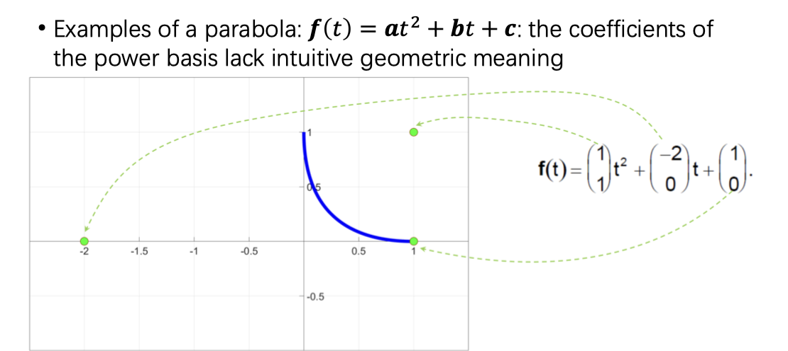
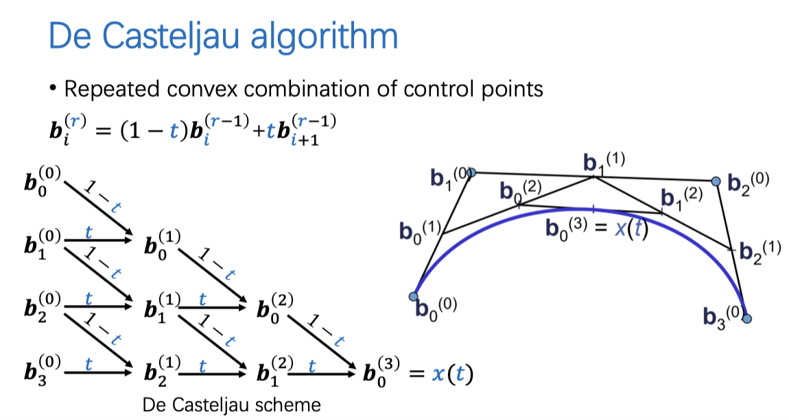
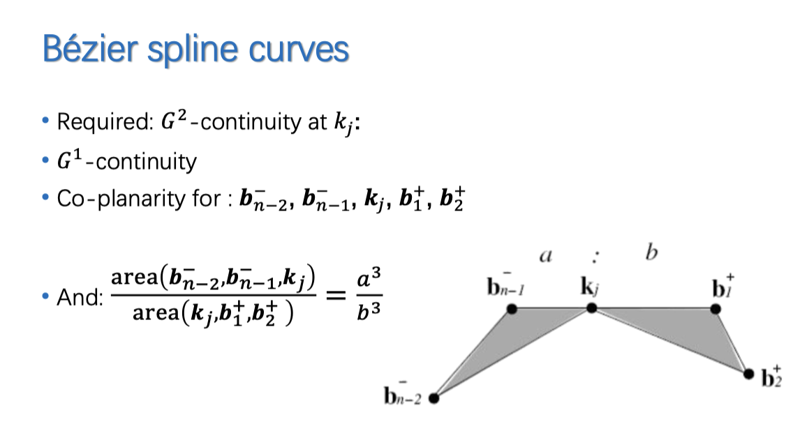
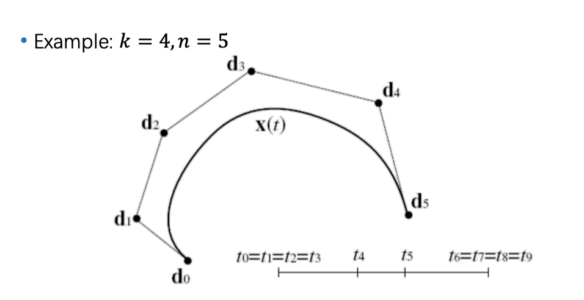

# CAGD

## 考试内容

- 平时作业：0.6；期末考试：0.4

Bezier Curve:

- Bernstein Basis, Properties
- De Casteljau
- Other properties.
- 升阶和细分

Bezier spline：

- 连续性
- 参数化

B样条：

- 定义
- deBoor
- 三次等距B样条
- 性质

极形式、开花

有理曲线：
- 齐次表达
- 权系数的意义
- 圆弧如何表达

张量积曲面

Bezier曲面片：重心坐标

细分
- 重心坐标

隐式曲面

其他：插值逼近、微分几何

作业！

1. NURBS是什么？
2. 控制点、参数、样条的阶数

## Lecture 01 - 插值与逼近

一般形式：
$$
\forall i= 1 \dots n, \sum \lambda_j b_j (x_i) = y_i
$$
矩阵：
$$
[b_j(x_i)] \Lambda = Y
$$

### 多项式插值

计算：

- $b_j(x) = x^{j-1}$
- 代入后，得到的 $B = [b_j(x_i)]$ 是Vandermonde矩阵

这个基存在的问题：

1. 矩阵稠密
2. 容易产生病态矩阵 ⇒ 条件数

解决方法：

1. 从条件数：使用正交多项式基（Gram-Schmidt正交化）
2. 避免求解方程组：使用拉格朗日插值方法

$$
P(x) = \sum_i y_i l_i
$$

其中的$l_i(x_j) =  \delta_{ij}$

多项式插值的结果：

1. Runge现象：高插值点数导致震荡。
2. 不稳定

### 逼近

多项式逼近：

1. Weierstrass定理
2. Bernstein多项式

最小二乘逼近：
$$
M = (b_j(x_i)) \implies \text{min} \| M \Lambda -Y\|
$$
法方程：
$$
M'M \Lambda = M'Y
$$

## Lec2 Bezier Curves

Reason:

幂函数基缺少几何含义（我们希望通过控制点控制曲线）



### De Casteljau Algorithm

```python
def Bezier(k, t):
	return reduce(k, lambda a, b: (1 - t) * a + t * b)
```



### Properties.

1. 凸包性质：生成的曲线一定在控制点的凸包内
2. Variation diminishing：任何的直线与Bezier曲线的相交次数不多于与控制曲线的相交次数
3. Global + pseudo-local：控制点的影响几乎是局部的（在局部最大）
4. Affine Invariance
5. Symmetry：`bezier(rev(k), rev(t)) == bezier(k, t)`
6. Linear Precision

### Polynomial description

$$
x(t) = \sum_{i = 0}^n B_i^n(t) b_i
$$

我们希望的性质：

1. smooth basis functions
2. local control.
3. affine invariance
4. Convex Hull Property.

主要讨论后两个

**Affine invariance**

线性不变（与线性变换和交换）：这是自然成立的，由基函数是线性组合给出

平移不变：这需要我们的基函数是Partition of Unity的，即对于所有的 $t, \sum B= 1$

**Convex Hull Property**

所有的系数都是正数。

### Bernstein Basis

$$
B_i^n (t) = C_n^i t^i (1-t)^{n-i}
$$
Properties:

1. Affine invariance.
2. Convex hull.
3. Smoothness -> Ok!
4. Local control: 全局基函数，但有一定的局部性。

Other Properties.

*Recursive computation*:

$$ B_i^n(t) := (1-t) B_i^{n-1} (t) + t B_{i-1}^{n-1}(1-t).$$

如果取到边界，那么：

$$ B_0^0(t) = 1, B_i^n(t) = 0 (\text{if i }\ne 0, ..., n) $$

*Symmetry*:

$$ B_i^n = B_{n-i} $$

*Non-negativity*:

$$ B_i^n \ge 0 \quad \forall t \in [0, 1] $$

### Degree elevation

输入：$n+1$个控制点，$n$ 次 Bernstein 多项式。

输出：$n+2$ 个控制点，$n+1$ 次 Bernstein 多项式。

Solution:

$ \hat b_0 = b_0, \hat b_1 = b_1, \hat b_j = \frac{j}{n+1} b_{j-1} + (1- \frac j{n+1}) b_j $

Use following to prove:

$$ f(t) = (1 - t) f(t) + t f(t) = \sum (1-t + t) B_i^n b_i = ... $$

### Bezier Curves - Subdivision

Input: $n$ 次 Bezier Curve

Output: 2 个 $n$ 次 Bezier Curve

如果在 $t$ 处进行分割，那么，选取de Casteljau 算法构成的三角形，两边的顶点作为输出。

## Lec03 - Matrix representations.

Homogeneous Coordinates:

1. Transformations -> Affine Transform.

### Bezier Curves

Cubic Bezier:

$$ f(t) = P_0 B_0 + P_1 B_1 + P_2 B_2 + P_3 B_3 $$

Matrix form:

$$ f(t) = \begin{bmatrix}
t^3 & t^2 & t & 1
\end{bmatrix} \begin{vmatrix}
-1 & 3 & -3 & 1\\
3 & -6 & 3 & 0\\
-3 & 3 & 0 & 0\\
1 & 0 & 0 & 0
\end{vmatrix} \begin{bmatrix}
P_{0}\\ P_1 \\ P_{2} \\ P_{3}
\end{bmatrix}$$

## Differential Geometry

### Parametric Curves

Parameterization of class $C^k$ of a curve in $\mathbb R^n$ is a smooth step
$c: I=[a,b]\to \mathbb{R}^n$ where $c$ is $C^k$.

**Velocity** vector: $c'(t)$

- $c'$: Direction of movement.
- $| c' |$: Speed.

**Regular Parameterization**:
1. $c'(t) \ne 0$ Forall $t$
2. regular => Ordinary Point.
3. non-regular => Singular Point.

### Change of Parameterization

**Allowable change of param**: any real smooth, differentiable function:

$$ f: I_1 \to I \quad f'\ne 0 \text{ on } I_1 $$

Parameter Transform:
- 我们希望研究那些不变量

### Geometric Observations.

Tangent vector:
$$ t = \frac{c'}{| c' |} $$

Normal Plane:
$$ (p - p_0) \cdot c_0' = 0 $$

Osculating Plane: 密切平面

$$ (c_0' \times c_0'') \cdot (p - p_0) = 0 $$

Rectifying Plane: 从切平面

$$ (c' \times (c' \times c'')) \cdot (p-p_0) = 0 $$

Frenet Frame:

- Tangent: $t = c'/ |c'|$
- Binormal: $b = c' \times c'' / \| c' \times c''\| $
- Principal normal: $n = b \times t$

**Curvature**:

1. Measures bending of a curve.

$$ \kappa = \frac{\| c' \times c'' \|}{\| c' \|^3} $$

Example:

1. circle: $\kappa = 1/r$
2. Helix: $\kappa = r / (r^2 + a^2) $

Special case: Planar Curves

$$ \kappa = \frac{x' y'' - x''y'}{(x'^2 + y'^2)^{3/2}} $$

**Torsion**: How far is the curve is from being a planar curve

$$ \tau = \frac{(c' \times c'') \cdot c'''}{ \| c' \times c''\|^2 } $$

Measure length of curve -- **Arc Length**

$$ L = \int_a^b \| c' \| \mathrm dt $$

### Arc Length Parameterized Curves

Consider the portion of $c(t)$, length $s$.

Transform: $s: c \to s$

优点：

- Principal Normal: 

$$ n = c'' / \| c''\| $$

### Frenet Curves

**Frenet curve**: Arc-length Parameterized curve $c$, in $\mathbb R^n$ s.t. $c', c'', ...$ are linear independent.

Gram-Schmidt Process -> consturction of Ortho Basis.

Planar curves:

$$ (e_1, e_2)' = \begin{vmatrix}
    0 & \kappa \\ -\kappa & 0
\end{vmatrix} (e_1, e_2) $$

### Fundamantal Theorem

For every smooth function, there is a unique curve that has this function as its curvature.

### Arc-length derivative

$$ f'(s) = \frac{1}{\| c' \|} f'(t) $$

Computing the Frenet frame:

$$ e_1(t) = c'(s) = c'/\|c'\|, \quad e_2 = \text{Rotate} e_1(t) $$

$$ \kappa = \langle e_1', e_2 \rangle $$

For 3d-space curves:

$$ E' = \begin{vmatrix}
 0 & \kappa & 0\\
 -\kappa & 0 & \tau \\
 0 & -\tau & 0
\end{vmatrix} E $$

General:

$$ E' = \text{Skew-Matrix} E $$

Summary: for arclength:

- Tangent: $t = c'$
- Binormal: $b = t \times n$
- Principal Normal: $n = t'/\|t'\|$
- Curvature: $\kappa = \|t'\| = \|c''\|$
- Curvature (Signed): $\kappa = t' = c''$
- Torsion: $\tau = - b'\dot n$

Special: Planar Curves

$$ \kappa = \frac{x'y'' - x''y'}{(x'^2 + y'^2)^{3/2}} $$

## Bezier Spline.

Problem:
1. High Polynomial degree.
2. Non-locality.
3. No Interpolation

### Parametric and Geometric Continuity

Parametric continuity: $C^0, C^1, C^2$.
1. Depends on Parameterization

Geometric continuity: $G^0, G^1, G^2$
1. Independent of Parameterization

Relation:
- $G^0 = C^0$
- $C^1 \implies G^1$: Tangent Direction has continuity
- $C^2 \implies G^2$:  curvature varies continuously

### Parameterization

Local and global param.

Input:

1. $b_0, ..., b_n$
2. $y(u)$: Curve on $[0, 1]$
3. $x(t)$: Curve on $[t_i, t_{i+1}]$

$u$: change of param $x(t) = y(u(t))$

$n-th$ curve for $y$:

$$ f(0) = p_0, f(1) = p_1 $$

$$ f'(0) = n (p_1 - p_0)\quad f'(1) = n(p_n - p_{n-1}) $$

$$ f''(0) = n(n-1)(p_2 - 2 p_1 + p_0)\quad f''(1) = n(n-1)(p_n - 2p_{n-1} + p_{n-2}) $$

General case: **Joining bezier curves**

$C^1$ Continuity:

$$ \frac{b_n - b_{n-1}}{t_j - t_{j-1}} = \frac{b_1 - b_0}{t_{j+1} - t_j} $$

$G^1$ Continuity: $[b_{n-1} k_j b_1]$ colinear.

### Cubic splines.

We want $C^0, C^1, C^2$ continuity.

$$ C^1: \quad \frac{b_n^- - b_{n-1}^-}{t_j - t_{j-1}} = \frac{b_1^+ - b_0^+}{t_{j+1} - t_{j}} $$

$$ C^2: \quad \frac{b_n^- - 2b_{n-1}^- + b^-_{n-2}}{(t_j - t_{j-1})^2} = \frac{b_1^+ - 2b_0^+ + b_2^+}{(t_{j+1} - t_{j})^2} $$

Define:

$$ d^- = b_{n-1}^- + \Delta_j / \Delta_{j-1} (b_{n-1}^- - b_{n-2}^-) $$

$$ C^2 \iff C^1 + d^- = d^+ $$

$G^2$



### End conditions

Bessel: Tangent vector in $k_0$ is equivalent to the tangent vector of parabola interpolating $k_0, k_1, k_2$

Natural: $x'' = 0$

## B-splines.

Deboor Recursion (Uniform case):

$$ N_i^1 (t) = \delta(i \le t < i+1) $$

$$ N_i^k(t) = \frac{t-i}{k - 1} N_i^{k-1} + \frac{i+k-t}{k-1} N_{i+1}^{k-1} $$

Properties:

Partition of Unity, Convex Hull.
- Local Support: $N_{ik} > 0$ on $t_i < t < t_{i+k}$
- $\sum N_{ik} = 1$

Continuity: $N_{ik} \in C^{k-2}$

**Multiple weighted knot vectors**



Properties:

$$ (t_0, ..., t_{2k-1}) = (0, ..., 0, 1, ..., 1) $$

Fall back to Bernstein Polynomial.

- Endpoint interpolation.
- $x'(t_0) = (k-1)/(t_k - t_0) (d_1 - d_0)$.
- $x(t)$ consists of $n-k+2$ poly curve segments of degree $k-1$.

```python
def deBoor(X, T):
  for i in [r-k+1, r]:
    d0[i] = X[i]
  for j in [1, k-1]:
    for i = [r-k+1+j, r]:
      alpha = (t-t[i])/(t[i+k-j]-t_i)
      d[j][i] = (1-alpha) * d[j-1][i-1] + alpah d[j-1][i]
  return x(t) = d[k-1][r]
```

### Interpolation

Input:
- $n+1$ cp $k_0, ..., k_n$
- $s_0, ..., s_n$

Output: Piecewise cubic interpolation b-spline $x$.

$$ x(s_0) = k_0 = d_0 $$

$$ x(s_i) = k_i = N_{i, 4} (s_i) d_i + N_{i+1, 4} d_{i+1} + N_{i+2, 4} d_{i+2} $$

$$ x(s_n) = k_n = d_{n+2} $$

End condition:

Natural end condition: $x''(s_0) = x''(s_n) = 0$

### Summary of Bezier and B-Spline curves

1. Bezier curve for $n+1$ cp:
   - Polynomial curve of deg $n$
   - Uniquely defined by cp.
   - Endpoint interp, remaining points are approximated.
   - pseudo-local impact of CP.
2. Interp cubic bezier spline curves by the control points $k_0,...,k_n$
   - Consists of $n$ piecewise cubic curve segments.
   - $C^2$ continuity.
   - Uniquely defined by parameterization.
   - Interp all cp.
   - pseudo-local
3. Piecewise cubic B-spline for cp. knotvector.
   - $n-2$ piecewise cubic curve segments which are $C^2$.
   - Uniquely defined by $d_i$ and $T$.
   - Endpoint interp.
   - Local impact of the de Boor points
4. Interpolating cubic B-spline.

### Exercises

For order 4 and knot seq.

$$ T = [t_0,...,t_7] $$

Evaluate

$$ N_{04}, N_{14}, N_{24}, N_{34} $$

de Boor Algorithm.

## Blossoming and Polar forms

Affine combinations.

Polar forms

- $1\to 1$
- $t \to t, 1 \to 1$
- $t^2 \to t_1 t_2, t \to \frac{1}{2} t_1 + t_2, 1\to 1$
- ...

Generalization.

1. Blossom for Polynomial curves
2. Blossom with points as arguments.
3. Vector arguments.

Derivatives:

$$
\frac{d^k}{dt^k} F(t) = \frac{n!}{(n-k)!} f(t, ..., t, \hat1, ..., \hat1)
$$

Continuity condition: TFAE.

1. $F$ and $G$ are C^k continuous at $t$
2. $\forall t_1, ..., t_k$, $f(t, ..., t, t_1, ..., t_k) = g(t, ..., t_1, ..., t_k)$.
3. $f(t, ..., t, \hat 1,..., \hat 1) = g(t, ..., t, \hat 1, ..., \hat 1)$

De Casteljau Algorithm

$$ b(000), b(001), b(011), b(111) $$


