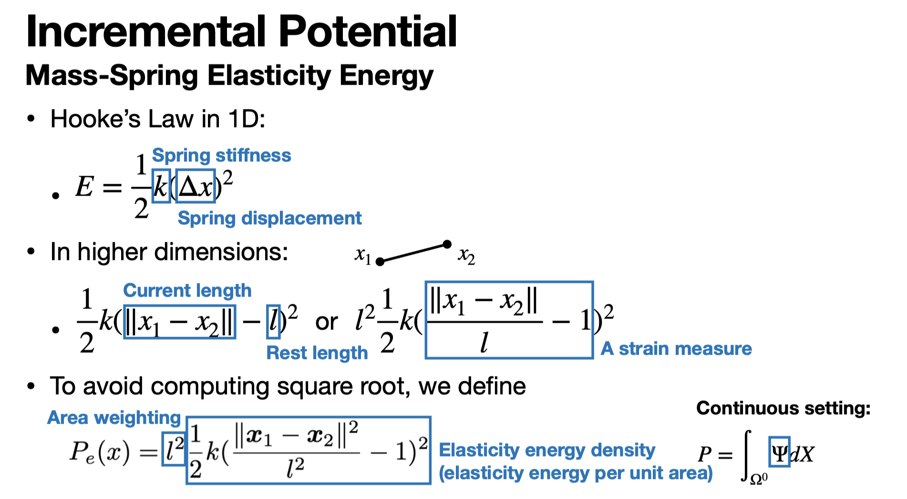

#! https://zhuanlan.zhihu.com/p/668263455
# 15-769: Lecture 1-4: Shape Repersentation, Time Integration, Mass Spring system, Dirichlet bc.

## 从零开始的 15-769: Physically-based Animation of Solids and Fluids

[Minchen Li](https://www.cs.cmu.edu/~minchenl/) 在 CMU 开设了 [15-769](https://www.cs.cmu.edu/~15769-f23/) 课程，里面用 Python 实现了一个基本的[带碰撞的固体求解算法](https://github.com/liminchen/solid-sim-tutorial/tree/main)，算法实现了 20 年的 [IPC](https://dl.acm.org/doi/abs/10.1145/3386569.3392425)的基本功能，算法的本质是优化中广泛使用的内点法。

上面这一段提到的 Python 代码是开源在 Github 的，用了 PyGame 进行可视化，整体上是一个二维的框架。为了更加深入了解这个算法，也是为了完善自己写的一个[计算框架](https://github.com/adversarr/axes)，考虑用 C++移植这个算法，并且实现到三维。

## Lecture 1: Shape Representation

Discrete Representation of Space and Time.

第一节课主要是提到了一些表示几何物体的方式：

### SDF：Signed Distance Function

设有几何物体 $\Omega$，表面为 $\partial \Omega$，我们可以定义如下的带符号距离：

$$
f(x) = \begin{cases}
  -d & x \in \bar\Omega\\
  d&
\end{cases}
$$

其中的 $d = \min_{y\in \bar\Omega} \| x - y\|$

反过来，给定 $f(x)$ 也确定了这样的几何体 $\Omega$。

问题是，如何给出 $f(x)$ 的表达式呢？一类是简单的情况，例如半径为 $r$，球心为 $c$ 的球，我们可以写出如下的：

$$ f(x) = \| x - c \| - r $$

这样有解析表达的几何体是很常见的，例如：

1. 半平面
2. 包围盒
3. ...

但总体上，有解析表达的这些物体还是相对很简单的。这里的 Notes 里给出了另一种新的可能，即用 Deep Learning 来表达 SDF（Park et al 2019, DeepSDF）。

当然也可以用离散的网格来存储格点处的 SDF 值来描述，这样的网格可以是均匀且稠密的，也可以是 VDB 之类的稀疏结构。

Remark：

1. 解析表达：准确、高校，但是形状是有限的，并且形状是不可变的
2. DL/NN：能更好嵌入到 AI 的任务中，还没有在 solid-simulation 中见到
3. 网格：对于形变更容易求解，但存储和计算成本搞。（类似 Eulerian 视角的物理场描述）

Note: All sdf are not often used for deformable solids (need both efficient representation of complex shapes).

### Points, and particles.

点云，例如表面重建。

SPH、MPM 方法，也可以一定程度上描述可变形体。

- 优点：破碎、拓扑变化处理简单
- 缺点：为了较高的精度，通常需要很多的点来描述。

### Mesh

Points conneted by elements. -> 顶点之间存在拓扑。

- FEM
- Mass spring

- 优点：如果 mesh 的质量高，那么解是比较精确的
- 缺点：拓扑变化后，涉及到 Remesh 问题。

### Hybrid - MPM

Particles on a background uniform grid.

- 优点：破碎、相比 particle 更加准确。
- 缺点：仍然需要比较多的 particle，而且需要“好”的分布（更均匀）

### Time Discretization

这一部分没啥好说的，也不展开提，总体的形式是：

$$ F = M a $$

这里的 $M$ 是质量矩阵。按通常的习惯：

$$
F = \begin{bmatrix}
  F_{1x}\\
  F_{1y}\\
  F_{1z}\\
  \vdots\\
  F_{nx}\\
  F_{ny}\\
  F_{nz}
\end{bmatrix}
$$

对 $a$ 也是类似的存储。

时间上的离散实际上很简单，只有一种方法，就是：

$$ t\_{i+1} = t_i + \Delta t $$

这样的划分。

## Lecture 2: Time Integration

这里我们假设读者已经知道基本的原理。

我们始终使用隐格式，因为通常认为隐格式能有更好的数值稳定性。

$$
\begin{cases}
	x^{n+1} = x^n + \Delta t v^{n+1}\\
	v^{n+1} = v^n + \Delta t M^{-1} f^{n+1}
\end{cases}
$$

我们消除 $v^{n+1}$，那么我们需要求解的是如下关于 $x^{n+1}$ 的非线性方程组：

$$
\frac{1}{\Delta t^2}M(x^{n+1} - (x^n + \Delta t v^n)) - f(x^{n+1}) = 0
$$

继续之前我们指出，也有很多其他的数值格式，但为了方便，我们先只考虑这个格式。

通常我们还只考虑保守力的情况，也就是 $\exists E, f(x) = -\nabla_x E(x)$，那整个问题实际上可以考虑为一个最优化问题（变分问题）

$$
\min_{x^{n+1}} \Phi(x^{n+1}) = \frac{1}{\Delta t^2} \| x^{n+1} - y\|_M^2 + E(x^{n+1})
$$

对于这个问题，我们可以直接利用结合如下技术的求解器进行计算：

1. Newton 法 – 二阶方法
2. BackTracking Line-search

其中，当我们拿到 Newton 法所需 Hessian 矩阵时，需要消除其负特征值来保证下降方向的正确。

## Lecture 3: Mass Spring

我们上面并没有考虑和弹性相关的内容，我们现在考虑最简单的一种情况，就是弹簧质点模型。

这里定义的 Potential 为

$$
P_e (x) = l^2 \frac{1}{2} k \left( \frac{\|x_1 - x_2\|^2_2}{l^2} - 1\right) ^ 2
$$

它和 Hooke’s Law 不是完全相同的。

对于它的梯度、Hessian 矩阵求解为：

我们还需要做的是将这样的局部矩阵装填到全局。

### Inertia Energy

其实这部分很简单，就是动能。

最终将矩阵装填有如下的代码，Hessian 的表示选择的也是 NNZ 表的形式

时间积分代码：

## Dirichlet BC

我们可以进行后处理。

对于这种情况，我们只需要将 Hessian 中

- $row = col$ 且为边界点的设为 $1$
- $row \ne col$ 但其中之一是边界点的设为 0

Gradient 中：

- $row$ 为边界点的设为 $0$

即可。
