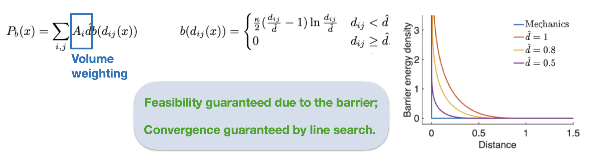

# 15-769: Lecture 5: Normal Contact with Distance Barrier

> 没有碰撞的固体是没有灵魂的
>
> 没有摩擦的碰撞是没有灵魂的
>
> —— 蒋陈凡夫《Variational Contact》

在上一篇中，我们主要提到了如下几点：

1. 物体的表示，我们后面主要用的是拉格朗日视角的描述，最最主要的是三角网格；
2. 各类的Energy：Inertia（惯性 or 动能），Gravity，Spring；
3. Time Integration，特别是 Implicit、Optimize-based Time Integration，将整个时间积分变为优化问题；

这次我们来看看 IPC 中最重要的一个部分：**碰撞处理**。

碰撞处理实际上还有很多方面的问题：

1. 碰撞检测，最难的是连续碰撞检测，也就是CCD
2. 碰撞响应，在检测到碰撞后，正确处理碰撞

IPC解决的是碰撞响应，它观察到：

> 物体没有碰撞 $\iff$ 物体的运动路径，没有**几何相交**

它的核心思想是：

> 定义基于几何体距离的 Log-Barrier，添加到原本的优化函数中，做内点法。

其实如果是了解后续几篇文章的读者不难看出，有一些文章是针对如何实现这样的barrier，例如：

- (JCP21) BFEMP：MPM-FEM
- (SIG 23) A Contact Proxy Splitting Method for Lagrangian Solid-Fluid Coupling：引入SPH流体

## Formulation

Inequality constraints:
$$
\forall k\quad d_k(x) \ge 0
$$
这里的 $k$ 是任何一对不同的点。$d_k$ 实际上是带符号的距离，之前我们在SDF提到过。例如，对于高度为$0$的水平地面，我们可以定义（$-y$ 为重力方向）：
$$
d(\bold{x}) = y - 0
$$
在后面的课程中，$d$也可以是无符号的距离，例如空间中两个不同的点的欧式距离。

我们首先考虑解的性质，Recap 之前的能量定义：
$$
E(x) = \frac{1}{2 h^2} \| x - y \| _M^2 + P(x)
$$
最小化问题为：
$$
\min E(x) \quad \mathrm{s.t.} A x = b,d_k(x) \ge 0\quad  \forall k
$$
其中的 $A$ 表明了系统的Dirichlet边界。

写出拉格朗日函数
$$
\mathcal L = E(x) - \lambda' (Ax - b) + \sum_k \gamma_k d_k(x)
$$
然后对 $x$ 求梯度，应用KKT
$$
\nabla E(x) - A' \lambda - \sum_k \gamma_k \nabla d_k(x) = 0
$$
外加几个条件：

1. 原始可行性：$Ax = b, d_k(x) \ge 0$
2. 对偶可行性：$\gamma_k \ge 0$
3. 互补松弛性：$\gamma_k d_k(x) = 0$，这里因为$\gamma, d$都是非负的所以每一项都是 $0$

在PPT中，提到了这几个性质给出的力学特征：

- 原始可行性 $\implies$ 无穿透条件
- 对偶可行性 $\implies$ 支持力不能指向墙内部
- 稳定性条件 $\implies$ 受力平衡
- 互补松弛性 $\implies$ 支持力只出现在出现碰撞的地方

之前也有针对这样的问题的求解方法：

1. Penalty - 惩罚方法，转化到无约束优化 ⇒ 不保证原始可行性，即不保证无穿透
2. Active set - 转化到等式优化 ⇒ 不保证收敛
3. Primal Dual-交替迭代 $x, \gamma$ ⇒ 收敛速度慢

我们的方法是Barrier method，它由如下的特点

1. 转化到无约束优化问题
2. 保证收敛、保证原始可行性、保证收敛速度

> 那么牺牲的是什么呢？后面再提。

有一些其他方法失败的例子，例如：

1. 出现穿透（Interpenetration）
2. 数值不稳定

## Barrier Method

> Convex Optimization(Stephen Boyd)

在这里我们先考虑最简单的情况，即墙面、地面等静止物体和一个可运动的物体的碰撞。我们要处理的碰撞实际上就是：
$$
d_{k} \ge 0
$$
内点法的形式是，对于优化问题：
$$
\begin{aligned}
	\min \quad &f_0(x)\\
	\text{s.t.}\quad &f_i (x) \le 0, i = 1\dots m\\
	& Ax = b
\end{aligned}
$$
转化为不含不等式约束，但含有指示函数$I_-$的形式：
$$
\begin{aligned}
	\min \quad &f_0(x) + \sum_i I_-(f_i(x)) \\
	\text{s.t.}\quad
	& Ax = b
\end{aligned}
$$
其中的 
$$
I_-(x) = \begin{cases}
	0 & u \le 0\\ \infty & u > 0
\end{cases}
$$
它保证了，如果可行域非空，那么一定目标函数的最优值一定不是$\infty$，从而保证不等式约束满足。

实际计算中，$I_-$通常可以通过 Log函数近似。

很显然的是，引入这样的Log-Barrier函数会使得最终求解得到的结果不完全是原问题的最优解，随着Log-Barrier对$I_-$的逼近程度提高，结果会越来越逼近最优解。例如如下的线性规划问题。

在Convex Optimization的567页，就有关于内点法的力学解释：

> We can give a simple mechanics interpretation of the central path in terms of potential forces acting on a particle in the strictly feasible set C. For simplicity we assume that there are no equality constraints.
>
> We associate with each constraint the force $F_i(x) = -\nabla (-\log (-f_i(x)))$, acting on the particle when it is at position $x$. The potential associated with the total force field generated by the constraints is the logarithmic barrier $\phi$. As the particle moves toward the boundary of the feasible set, it is strongly repelled by the forces generated by the constraints.
>
> …

总结来说，描述了两件事情：

1. Log-Barrier实际上是添加了边界对粒子的一个势能，这个势能在粒子充分靠近边界时趋于$+\infty$，从而产生充分大的作用力将粒子推离边界；
2. 另一方面，随着Log-Barrier不断逼近 $I_-$，边界产生的力场在更多的区域上趋零，在边界处越来越逼近了$I_-$，那么粒子的平衡位置，也就是求解结果随着这个逼近过程越来越靠近最优解

好吧，让我们回到这门课的内容，这里我们定义的 Log-Barrier是不太一样的，因为我们的不等式约束是非常多的，假设我们的场景中有 $N$ 个几何体（点、线、面），考虑它们之间不相互穿透带来的不等式约束，那么很可能产生的不等式数量是$O(N^2)$量级的，一个较为简单的模型，例如一个四面体就包含了 $N = 4 + 6 + 4 = 14$ 个这样的元素，$N$的量级是很大的。

因此，在这里采取的做法是，将Log-Barrier在一定的范围外直接置零，这里的范围选作 $\hat d$

但是有一点需要注意的是，这里的 $b$ 的定义实际上并不是IPC原文的定义：

其主要的区别在于，这个函数在 $\hat d$ 处是否是 $C^2$的。

这样一番操作是否理论上合理呢，PPT给出了答案：

1. 原始可行性 - Barrier函数保证
2. 对偶可行性 - Barrier 函数保证
3. 稳定性 - 被迭代终止条件保证，这里说的Newton实际上可以换做任何一个求解器
4. 互补松弛性 - 降低 $\hat d$ 可以提升精度

## 实现

一个问题：下降方向 $p = -H^{-1} g$ 并不能保证原始可行性，即无穿透条件。我们可以做的一个方法是：

1. 搜索 $x \to x+p$上，产生碰撞的最小时间 $t_0 \in (0, 1]$（这个过程实际上就是CCD）
2. 将线搜索的初始步长设置为 $\alpha = \min\{1, t_0\}$，实际为了避免距离直接变为 $0$，设置为 $\alpha = \min\{1, 0.9 t_0\}$

最终算法：

## Remarks

几点说明，首先是CCD是必须的，我们找的是路径上不发生穿透的点：

第二点，也是我最近比较关注的点，就是如果不是拉格朗日视角的物体表达怎么办？

1. 欧拉网格的流体，实际上固定网格点的数据
2. SDF表达的数据

这里带来的一个问题是Cut Cell，用线性插值带来的通常是不精确、不光滑的物体边界。这里也提供了可能的解决方案：

1. 高阶的B-样条，解决光滑性
2. 始终使用同一种插值方法

### 简单提一下代码实现。

存在的问题：

1. 能量的value、grad、hessian暂时写头文件了，后面可能还得改改
2. 实现部分没啥注释
3. 没做Project Newton，假定所有的Hessian正定，收敛会慢一点

主要代码：

1. 求解器：[solver.cpp](https://github.com/Adversarr/axes/blob/main/axes/source/physics/solid_sim/solver.cpp)
2. 相关能量的实现：[solid_sim](https://github.com/Adversarr/axes/tree/main/axes/include/axes/physics/solid_sim)
3. 具体的可执行程序：[solidsim-spring](https://github.com/Adversarr/axes/tree/main/examples/solidsim-spring)

