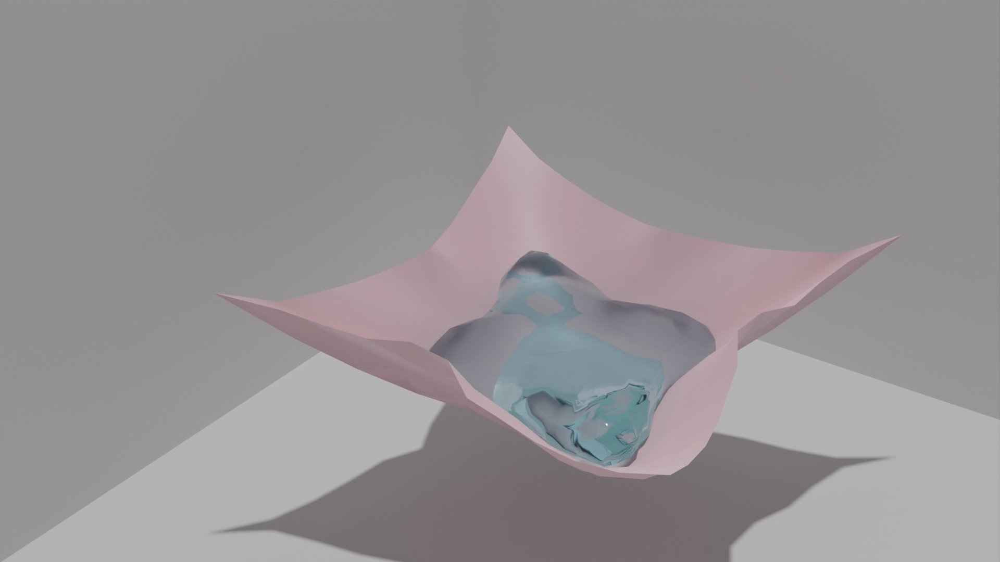

# Adversarr

Hi there! Here is the blog for [Adversarr](https://github.com/adversarr), a graduate student from USTC. I'm major in Computational Mathematics. I'm interested in Computer Graphics, especially Physical Simulation in CG/CAD apps.

Here are some quick-look of my work.

## Two way Fluid-Solid Coupling, i.e. Strong FSI

See [ACG/hybrid_admm_ct](https://github.com/Adversarr/ACG/tree/main/examples/hybrid_admm_ct).

